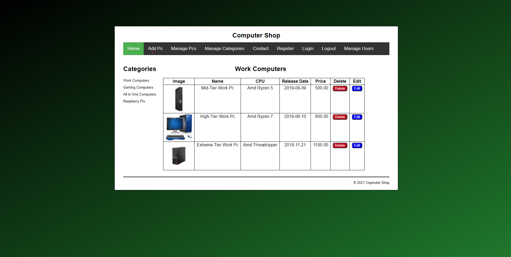

# computer-shop PHP and CRUD application
This repoistory hosts a working computer shop PHP crud application. Please feel free to download the code and mess around with it to your own desire and to help make your own application. If you find any bugs and or errors feel free to email me them on: D00228088@student.dkit.ie

### Software Needed
- Apache
- Software that can run php e.g VS CODE

### Instructions
* Create a MySQL database called computer_shop in PHP MyAdmin
* Run the code in the sql-db.txt file in PHP MyAdmin
* Move the PHP files in to your htdocs folder so Apache can process the PHP code
* Configure the database.php file to connect to your SQL database

## Preview of Application

